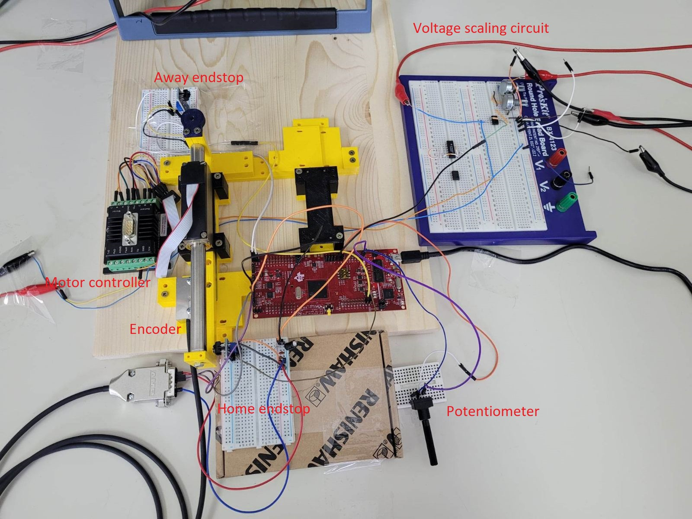
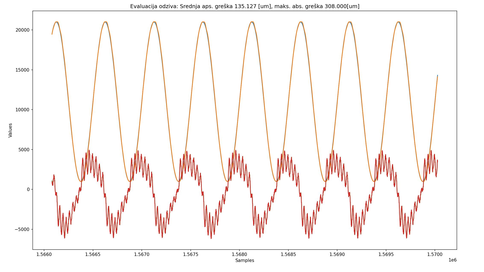
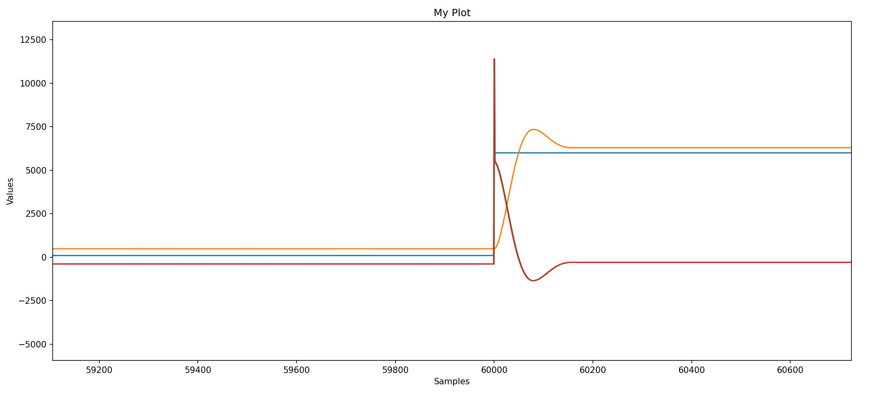
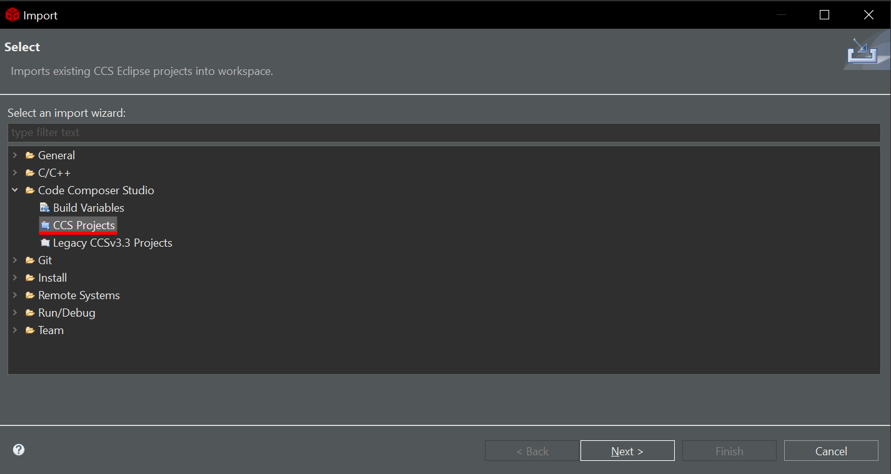
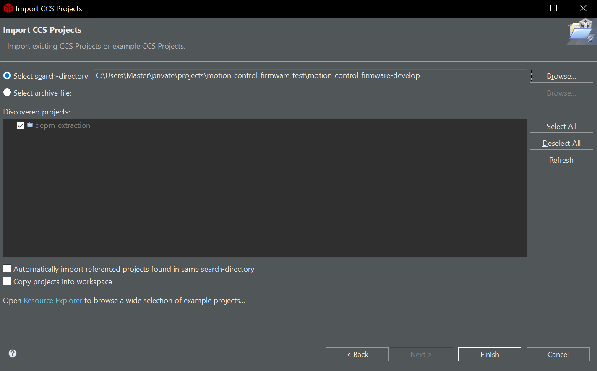
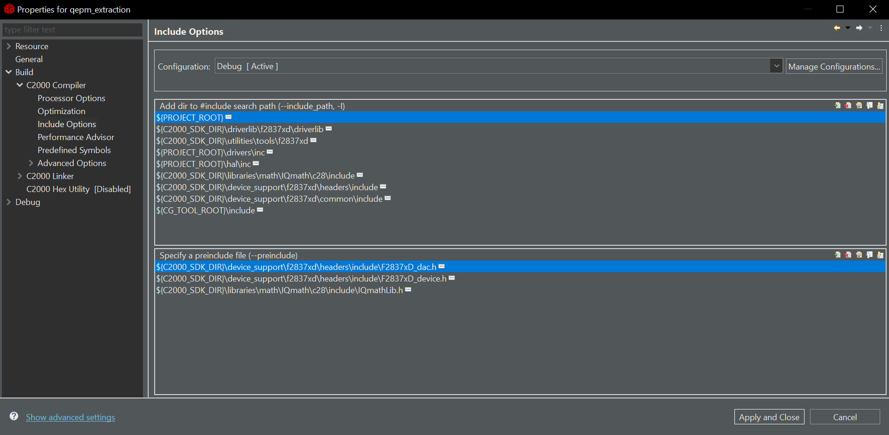
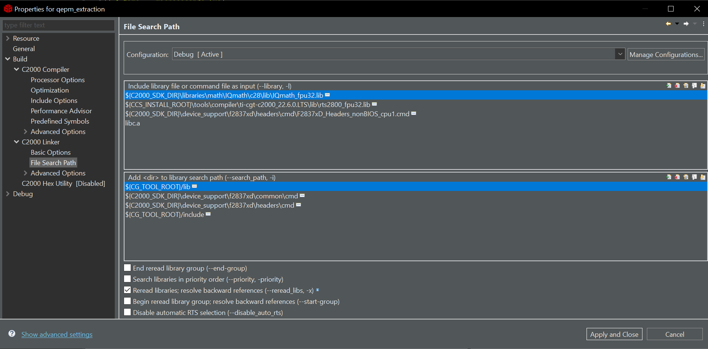
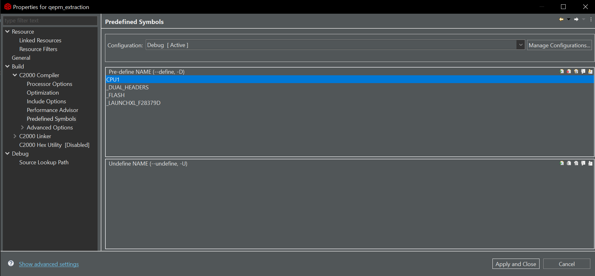
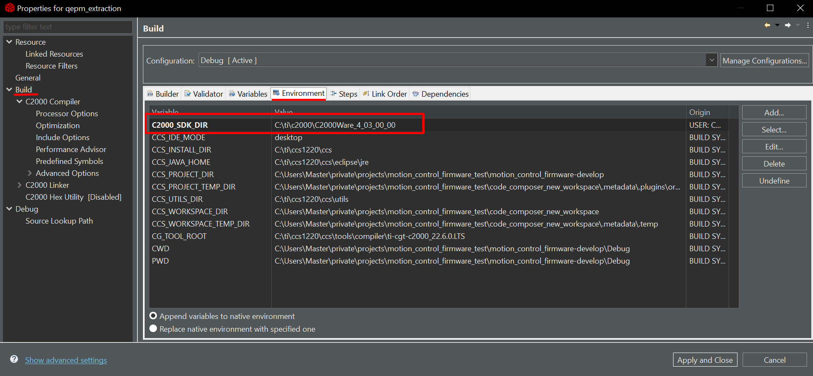
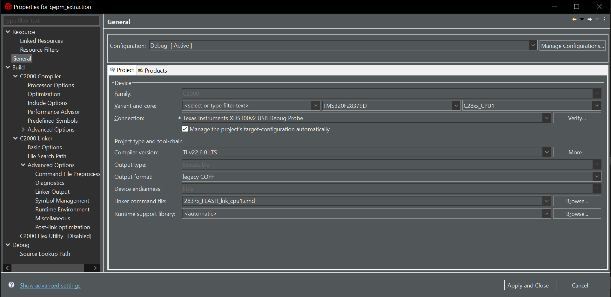

# Motion control firmware for C2000 LaunchPad

Welcome to the firmware repository for C2000 series LaunchPAD running motion control algorithm discussed during ETF's *Motion Control* Course 22/23.

This repository contains the firmware code for the C2000 series LaunchPAD, a popular development platform for motion control  applications. The firmware is specifically designed to run motion control algorithms on the LaunchPAD F28379D utilizing the experimental setup specially designed for the Couse.

The setup consists of:

- **RENISHAW RGH24O15D30B** - incremental encoder with 10nm resolution

- **FAULHABER LM2070-080-11-C** - linear DC motor

- **FAULHABER MCLM3006** - motor controller

- **Texas Instruments LaunchPADXL F28379D** - microcontroller

  


> *3D design of a single pantograph assembly showing 2 linear actuators connected together. Encoders and motor controllers are not shown in this design*

Besides this, it's possible to include potentiometer as a source of analog voltage to control the position of a single (or both of) linear actuators. Optical (IR based) end stops are also possible to include as a safety feature. 

The wiring diagram for the LaunchPad is shown below. 


Analog out is connected to voltage scaling circuit, which is later connected to the motor controller controlling motor torque. Analog out can be used for controlling the setpoint of a linear actuator. Strobe pin is used for real-time debugging. The strobe pin is high when the controller is active in a control loop, i.e. processing, and it's low when the controller is sleeping (waiting). The PB1 and PB2 are active low, and are activated on a falling edge. The RENISHAW encoder can be directly powered from the LaunchPAD.



> *Testing setup used for response evaluation.*

### Code

The firmware is configured using pre-processor directives found in `main.h`. The used trajectory tracking algorithm is described below and implemented in `main.c`.


The control algorithm is implemented in the `main.c`, `controlLoop()` function which is executed every timer tick. The default period of a tick is 1[ms] or 1000 [us]. Most of the units are in the micro- prefix. Set point and actual value of trajectory are in **micrometers** (1/1000000 meter) and they are in an **unsigned format**, so no negative values for trajectory. I encourage you to dive in to the code and find out the details for yourself. 

In the `main.h` you can configure various system parameters and change the microcontroller operating modes.

For example, with the `TRAJECTORY_SELECT` you can change the way the setpoint is fed in to the control algorithm.

```c
// *** SELECT THE TRAJECTORY INPUT ***
// *HARDCODED: supplied using lookup table
// *ANALOG_READ: obtained using analog read
// *STEPS: alternating step of specified amplitude (start: STEPS_VALUE_1, stop: STEPS_VALUE_2)
// *SINE: sine wave of controllable frequency, using the analog input (potentiometer)
// *FIXED: fixed value of the trajectory
#define TRAJECTORY_SELECT ANALOG_READ
```

In every iteration, the microcontroller sets the STROBE pin to high when it's processing, i.e. measuring, calculating, setting or sending data, and back to low when it's sleeping and waiting for the tick period to elapse. With a precise equipment like an oscilloscope or a logic analyzer this can be used for timing the microcontroller and evaluating the control algorithm computation complexity. 

The baseline for the "clean" control algorithm is around 7 [us], and with serial data transfer is around 500[us]. Make sure not to lower the tick period below these values. If you want higher tick frequencies, try disabling sending of serial data. 

Current values of **trajectory**, **actual position**, **estimated disturbance** value and **control force** (tau) are sent over serial port every iteration with baud rate of 460800. In the  `external_tools/response_capture_serial` you can find tools for capturing and visualizing the data from the microcontroller. Some of the responses were captured and shown below. 



> *Response of 2Hz sine wave of amplitude of 10mm and bias of 11mm. Orange actual value, blue set point, red control force value. **Maximum absolute error: 308[um] (1,5%); Average absolute error: 135[um] (0.675%)***



> *Step response with untuned parameters. Orange actual value, blue set point, red control force value.* 

### Further Development

The firmware is open-source, meaning that you can modify  and extend it to suit your specific needs. It includes a range of  features, such as real-time control, advanced motion control algorithms, and support for multiple motor types. 

To start developing first install the [Texas instruments Code Compose Studio](https://www.ti.com/tool/download/CCSTUDIO/12.2.0) and download & install [TI C2000 Software development kit.](https://www.ti.com/tool/C2000WARE)

After that, just import this project and start playing with it.

1. Create a new Code Composer Project workspace.
2. Import the the project obtained from the repository. 
3. Build and load the code on the microcontroller. 

Importing by selecting Import CSS Projects. 



Select the project directory you've obtained from the repository. 



The reason everything from the CSS project was versioned is because there is some settings related to the include files and pre-compiler flags need to build the project saved somewhere in the CSS files. When you download the project from the repository **you should be able to build the project without any issues**. If you face any issues it's probably because include settings, or pre-compiler flags. 

Check the Include Options in the Compiler Menu:



 Linker Options:



Pre-compiler flags:



**Make sure to specify the path to the downloaded C2000 SDK in the environment variables**



Check to see if the general menu matches:




#### Hardware configuration

In the case of new motor and motor controller, make sure to configure the the controller to be in torque (and not position) mode using the [FAULHABER Motion Manager](https://www.faulhaber.com/en/support/faulhaber-motion-manager/) software. 

To interface the motor controller, you will need USB-to-RS232 connector connected to the RX and TX pins of the controller. 

### Known issues

- Due to high resolution of the encoder, the maximum actuator speed at which the encoder functions is much lower than the speed at which the actuator can actually run. The maximum encoder speed is around 6.5 cm/s, while the motor speed is 180 cm/s (it's not a typo :)). Because of this, in sine response evaluation the system is unstable at around 3Hz for 10mm amplitude. 
- Every time you activate the end stop IR sensor you zero (or max out) the actual actuator position. Make sure not to do that unintentionally with your fingers because it will lead to severe system instability.   

### TODOs

- Find an alternative encoder with supported higher speeds

- Enable support for two motion control algorithms running in parallel. Due to object-oriented design of components,  it should be easy to instantiate two (instead of a single) components for motor controller and control algorithm.  

- Enable support for haptic feedback motion control using the second encoder-motor setup. 

   
