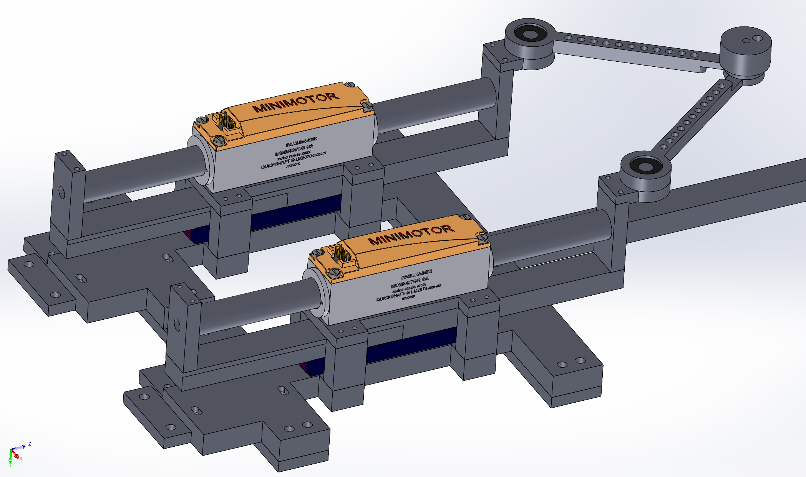
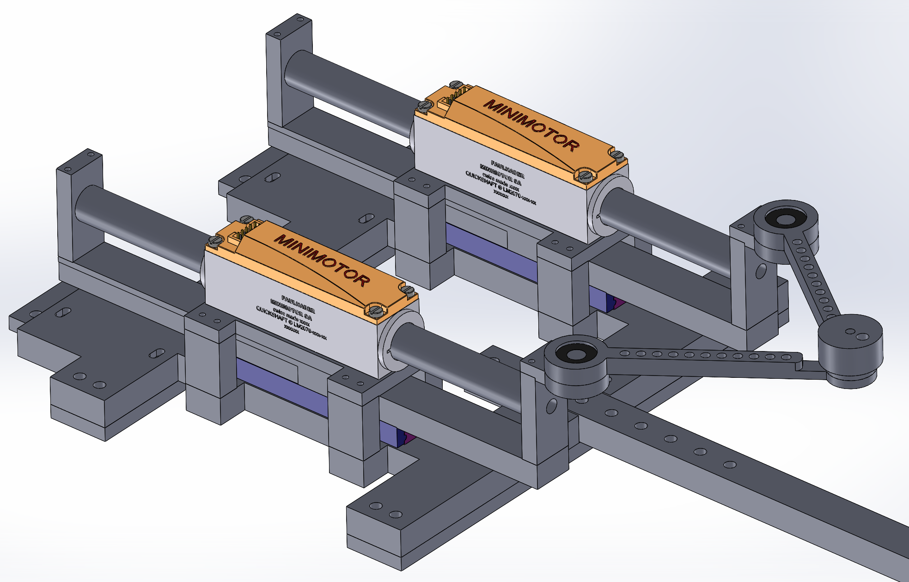
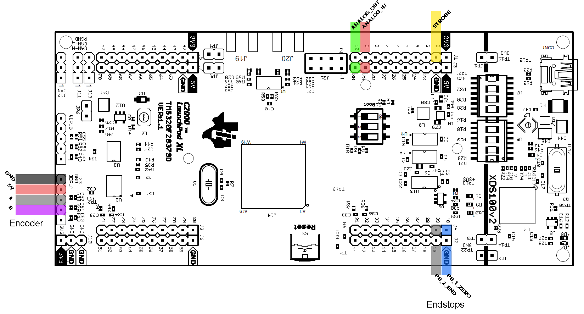
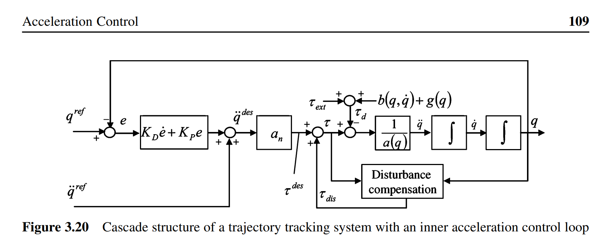

# Motion control firmware for C2000 LaunchPad

Welcome to the firmware repository for C2000 series LaunchPAD running motion control algorithm discussed during ETF's *Motion Control* Course 22/23.

This repository contains the firmware code for the C2000 series LaunchPAD, a popular development platform for motion control  applications. The firmware is specifically designed to run motion control algorithms on the LaunchPAD utilizing the experimental setup specially designed for the Couse.

The setup consists of:

- RENISHAW RGH24O15D30B - incremental encoder with 10nm resolution

- FAULHABER LM2070-080-11-C - linear DC motor

- FAULHABER MCLM3006 - motor controller

  

> *3D design of a single pantograph assembly showing 2 linear actuators connected together. Encoders and motor controllers are not shown in this design*

Besides this, it's possible to include potentiometer as a source of analog voltage to control the position of a single or both of linear actuators. Optical (IR based) endstops are also possible to include as a safety feature. 

The wiring diagram for the LaunchPad is shown below. 

Analog out is connected to voltage scaling circuit, which is later connected to the motor controller controlling motor torque. Analog out can be used for controlling the setpoint of a linear actuator. Strobe pin is used for real-time debugging. The strobe pin is high when the controller is active in control loop, i.e. processing, and it's low when the controller is sleeping. The PB1 and PB2 are active low, and are activated on a falling edge. The RENISHAW encoder can be directly powered from the LaunchPAD.

The firmware is configured using pre-processor directives found in `main.h`. The used trajectory tracking algorithm is described below and implemented in `main.c`

The firmware is open-source, meaning that you can modify  and extend it to suit your specific needs. It includes a range of  features, such as real-time control, advanced motion control algorithms, and support for multiple motor types. Additionally, it includes a  comprehensive set of examples and tutorials to help you get started  quickly and easily.

We hope that you find this firmware repository helpful in  your motion control development efforts. If you have any questions or  comments, please don't hesitate to reach out to us via the issue  tracker.

### Firmware development

To start developing first install the [Texas instruments Code Compose Studio](https://www.ti.com/tool/download/CCSTUDIO/12.2.0) and install [TI C2000 Software development kit.](https://www.ti.com/tool/C2000WARE)

After that, just import this project and start playing with it.

TODOs:

-  Pomenuti koje sve stvari je neophodno dodati unutar projekta kako bi se projekat mogao buildovati
-  Pomenuti da su jedinice referentne pozicije u unsigned int formatu
   -  Dotaći se drugih jedinica i kako su one formatirane
-  Dodati Environment varijablu C2000_SDK_DIR da bude C:\ti\c2000\C2000Ware_4_03_00_00
